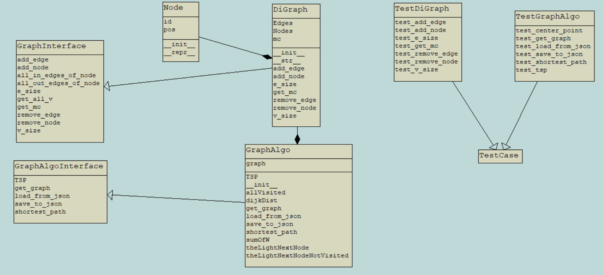

# Graph Drawer - python
In this project, we were tasked to recreate our work from the previous assignment (written in Java) to Python.

As you'll see, in this project, you can load graphs from json files, edit the graph and run some algorithms on the graph.

Graph with 1,000 Nodes:

# Analysis of the performance of the algorithms:

# UML Diagram

This is a uml of the project:

# How To Use:

__1. Clone this repository:__

## DiGraph class - implements GraphInterface

This class implement GraphInterface abstract class that represents an interface of a graph.

Each DiGraph contain dictionary of his nodes, and each node contain his edges.\
In addition each DiGraph holds the number of edges in the graph and a mode counter (mc)\
that represent the number of changes (add node, add edge, remove node or remove edge) in the graph.

## GraphAlgo class - implenents GraphAlgoInterface
his class implement GraphAlgoInterface abstract class that represents an interface of a graph.\
Each GraphAlgo contain a DiGraph on which the algorithm works on.

## External info:
- More about graph : https://en.wikipedia.org/wiki/Directed_graph
- More about matplotlib : https://matplotlib.org   
